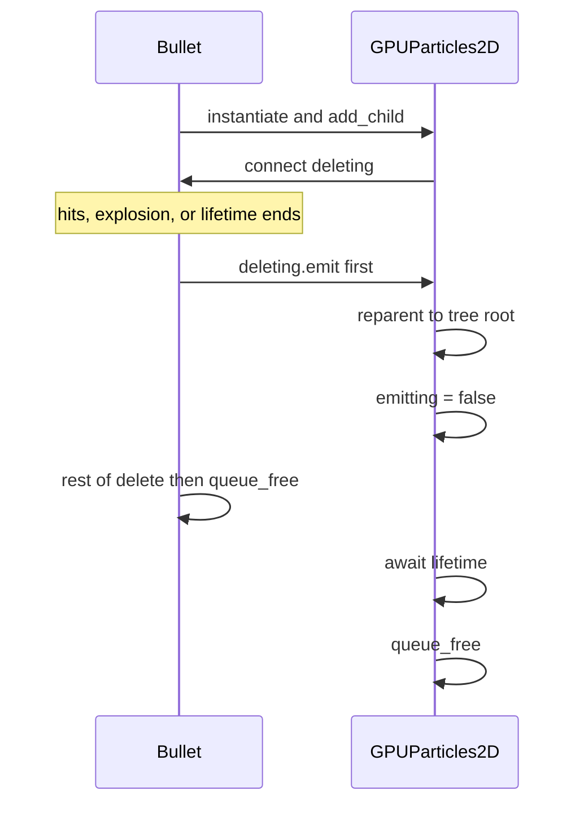

# Bullet particle linger

Reuse this whenever a projectile should leave a GPUParticles trail that **keeps playing after the bullet is freed**.

Reference implementation: `scenes/playerbullet.gd`, `scenes/playerbullet_particles.tscn`, `scenes/playerbullet_particles.gd`.

Apply the same pattern next to frost (`scenes/playerbullet_frost.gd`, `scenes/frost.tscn`) and fireball (`scenes/playerbullet_fireball.gd`, `scenes/fire_ball.tscn`).

## Split of work

1. **Agent / code:** create a new empty `GPUParticles2D` scene, attach the linger script, and wire spawn + `deleting` on the bullet.
2. **Human:** open that GPUParticles scene in the editor and author the **visual** (texture, process material, color, amount, lifetime, emission shape, scale/alpha curves). Do not expect the code pass to look “final.”

## Why reparent

If the particles stay a child of the bullet, `queue_free()` on the bullet kills them immediately. On `deleting`, the particle node must `reparent` to the tree root **before** the bullet frees, then stop emitting and wait its own `lifetime`.



## 1. Create a new GPUParticles scene (empty visual)

For each projectile, add a dedicated scene. Do not instance it in the bullet `.tscn`; the bullet script spawns it.

Suggested names:

| Projectile | Scene | Script |
|---|---|---|
| Sharp (done) | `scenes/playerbullet_particles.tscn` | `scenes/playerbullet_particles.gd` |
| Frost | `scenes/frost_particles.tscn` | `scenes/frost_particles.gd` (or a shared linger script) |
| Fireball | `scenes/fireball_particles.tscn` | `scenes/fireball_particles.gd` (or shared) |

Root node: `GPUParticles2D`. Leave `emitting` on (default). Leave material/texture as placeholders. The human will fill those in.

Godot’s `lifetime` on `GPUParticles2D` is the linger duration after stop. Set a sensible default (often `1`); the human can tune it with the look.

Keep `local_coords` off (default) so already-spawned particles stay in world space while the emitter moves, then fade after stop.

## 2. Particle linger script

Attach this to the GPUParticles2D root. `setup` must run after the node is a child of the bullet.

Use a generic bullet type if frost/fireball are not `PlayerBullet`:

```gdscript
extends GPUParticles2D


func setup(bullet: Node) -> void:
	bullet.deleting.connect(_on_bullet_deleting)


func _on_bullet_deleting() -> void:
	reparent(get_tree().root)
	emitting = false
	await get_tree().create_timer(lifetime).timeout
	queue_free()
```

The handler is synchronous until the `await`, so `reparent` and `emitting = false` finish before the bullet’s `queue_free()`.

## 3. Bullet script

On the projectile script (`PlayerBullet`, `PlayerBulletFrost`, `PlayerBulletFireball`):

1. `preload` the matching particles packed scene.
2. Add `signal deleting`.
3. In `initialize()`, instantiate, `add_child` on the bullet (so the trail follows), then `particles.setup(self)`.
4. `delete_bullet()` must **emit `deleting` first**, then do the rest (explosion, `queue_free()`, etc.).
5. Route the lifetime timer through the same delete path so trails linger on timeout too.

Sharp example:

```gdscript
const PARTICLES_SCENE := preload("res://scenes/playerbullet_particles.tscn")
signal deleting

func initialize(...) -> void:
	# damage / speed / sfx as usual
	_spawn_particles()

func _spawn_particles() -> void:
	var particles = PARTICLES_SCENE.instantiate()
	add_child(particles)
	particles.setup(self)

func delete_bullet() -> void:
	deleting.emit()
	queue_free()

func _on_lifetime_timeout() -> void:
	delete_bullet()
```

### Frost and fireball

Those currently `create_explosion()` then `queue_free()` inside `delete_bullet()`, and lifetime timeout skips that and frees immediately.

Required:

```gdscript
func delete_bullet() -> void:
	deleting.emit()
	create_explosion(c)

func _on_lifetime_timeout() -> void:
	delete_bullet()
```

`create_explosion` still `queue_free()`s the bullet after spawning the explosion. Emitting first is what lets the trail reparent and linger. Spawn trail particles in `initialize()`, same as sharp.

Do not instance the particles scene as a child in `frost.tscn` / `fire_ball.tscn`.

## 4. Human: author the visual

In the new `GPUParticles2D` scene, set:

- Texture
- Process material (direction, spread, gravity, emission shape)
- Color / alpha curves
- Amount, lifetime, explosiveness, speed scale
- Any charged-shot extras (sharp currently does `amount *= 3` in code after spawn)

Code should not try to “finish” the look. After the scene and wiring exist, the human edits the GPUParticles effect in the editor.

## Checklist for a new projectile

- [ ] New `GPUParticles2D` `.tscn` (empty look is fine)
- [ ] Linger script attached; `setup` connects `deleting`
- [ ] Bullet preloads and spawns that scene in `initialize()`
- [ ] `signal deleting` on the bullet
- [ ] `delete_bullet()` emits `deleting` as the first line
- [ ] Lifetime timeout calls `delete_bullet()`
- [ ] No leftover instanced particles child on the bullet scene
- [ ] Human authors the GPUParticles visual in the editor
